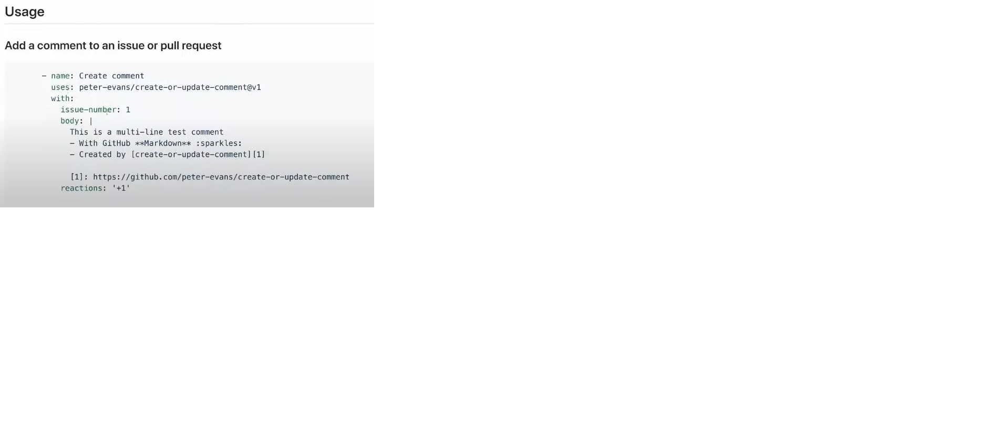
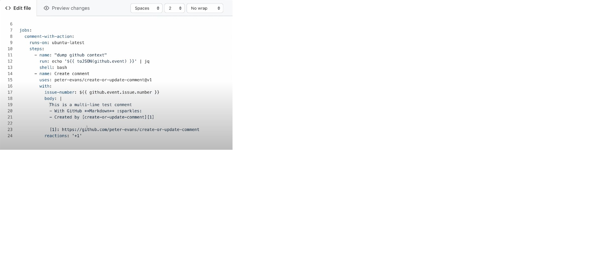

#### [Github actions full course] E1 강의

  1. Overview of GitHub Actions
  2. Workflow Syntax
  3. Community Actions
  4. GiHub APIS in Workflows

### Overview
The Components of GiHub Actions
```
Event
* Pull Request
* Push(branch)
* Issue -> Created 
              -> Created
                  -> Created
```

```
Job  : Runner
 -> Step  : Run Step ->Log Results
```

Choose MIT License

Re-run jobs - 한가지 작업에 대해 재실행 가능함


### Community Actions
Create or Update Comment [Github Action] </br>





#### Using GitHub APIS in Workflows

```
comment-with-api:
  runs-on: ubuntu-latest
  steps:
    - name: Create comment with API
    run:
      gh api -X POST \
        http://api.github.com/repo/${ORGANIZATION}/${REPOSITORY}/issues/${ISSUE_NUMBER/comments \
        -f body='
        Comment but from the API call not action
        '
    env:
      GITHUB_TOKEN: ${{ secrets.GITHUB_TOKEN }}
      ORGANIZATION: ${{ github.event.organization.login }}
      REPOSITORY: ${{ github.event.repository.name }}
      ISSUE_NUMBER: ${{ github.event.issue.number }}
      }
```

Commit changes
