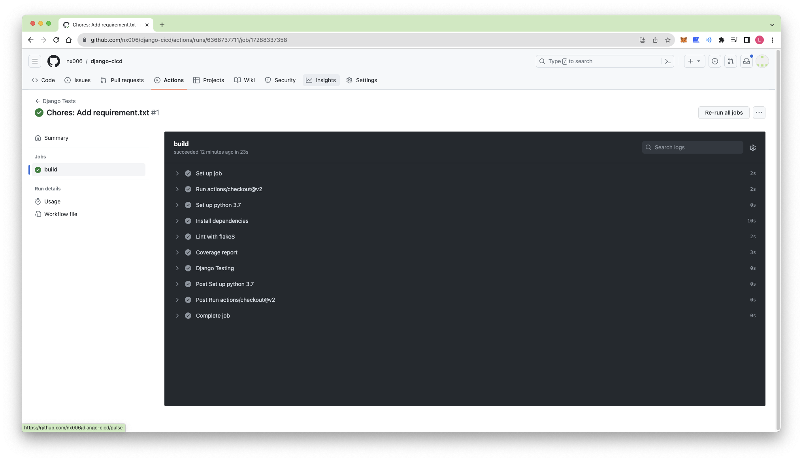

# github action with django
## Django Project Setup

```bash
$ python3 -m venv venv
$ source venv/bin/activate
$ pip install django
$ django-admin startproject djangocicd
$ cd djangocicd
$ python manage.py startapp blog
$ python manage.py makemigrations
$ python manage.py migrate
```

## Test
### Test coverage
Python에는 coverage라는 유용한 테스트 커버리지 체크 도구가 있다. 이 도구는 현재 프로젝트의 테스트 커버리지 범위가 어느 정도인지 보고서를 생성해준다.

```bash
$ pip install coverage
$ coverage run --omit='*/venv/*,/opt/*' manage.py test
$ coverage report
$ coverage html
```

### Test run
Test를 생성한다.

예를 들어서 아래와 같은 Model이 있다고 해보자.

```python
# blog/models.py
from django.db import models


class Post(models.Model):
    title = models.CharField(max_length=255)
    author = models.CharField(max_length=255)
    slug = models.SlugField(max_length=255, unique=True)

    def __str__(self) -> str:
        return self.title
```

이 Model에 대한 Test를 아래와 같이 작성한다.

```python
from django.test import TestCase
from .models import Post


class ModelTesting(TestCase):
    def setUp(self):
        self.blog = Post.objects.create(title="django", author="admin", slug="django")

    def test_post_model(self):
        d = self.blog
        self.assertTrue(isinstance(d, Post))
        self.assertEqual(str(d), "django")
```

이제 Test를 실행해보자.

```bash
$ python manage.py test
```

### Code format check
테스트 외에 코드 퀄리티를 높이기 위해서, 코드 포맷 체크 역시 매우 중요하다. 이를 위해서 flake8 도구를 사용한다.

```bash
$ pip install flake8
```

기본 flake8 설정은 django의 규칙과 충돌하는 부분이 있다. 이 부분을 `setup.cfg` 파일을 생성해서 해결한다.

```ini
[flake8]
exclude = .git,*migrations*,*venv*
max-line-length = 119
```

```bash
$ flake8
```

## Github Action
github action을 사용하기 위해서 `.github/workflows` 디렉토리를 생성하고, 그 안에 yaml 파일을 생성한다.

```yml
name: Django Tests

on:
  push:
    branches: [main]
  pull_request:
    branches: [main]

jobs:
  build:
    runs-on: ubuntu-latest

    steps:
    - uses: actions/checkout@v2
    - name: Set up python 3.7
      uses: actions/setup-python@v2
      with:
        python-version: 3.11
    - name: Install dependencies
      run: |
        python -m pip install --upgrade pip
        pip install -r requirements.txt
    - name: Lint with flake8
      run: |
        pip install flake8
        flake8 .
    - name: Coverage report
      run: |
        pip install coverage
        coverage run manage.py test
        coverage report
    - name: Django Testing
      run: |
        python manage.py test
```

이때 Lint with flake8과 coverage를 별도로 설치하는 이유는, 실제 Production 환경에서 image 크기를 줄이기 위해서, `requirements.txt`에 dev-dependencies인 flake8과 coverage는 제거하고 배포할 수 있기 때문이다. 그래서 CI/CD 파이프라인에서는 설치를 명시적으로 한다.

